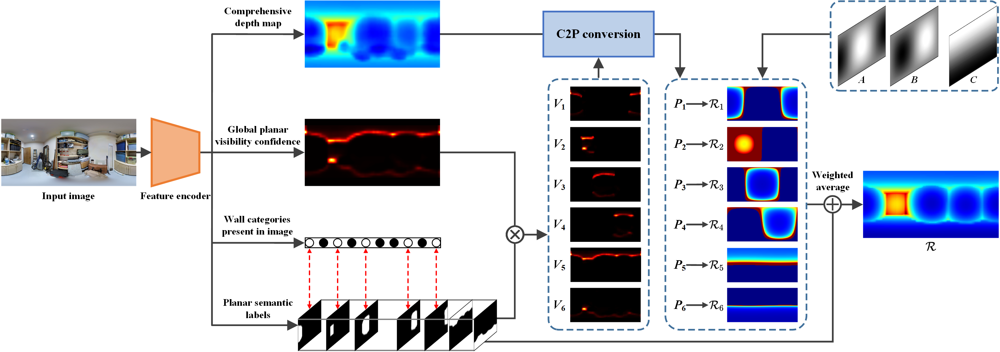
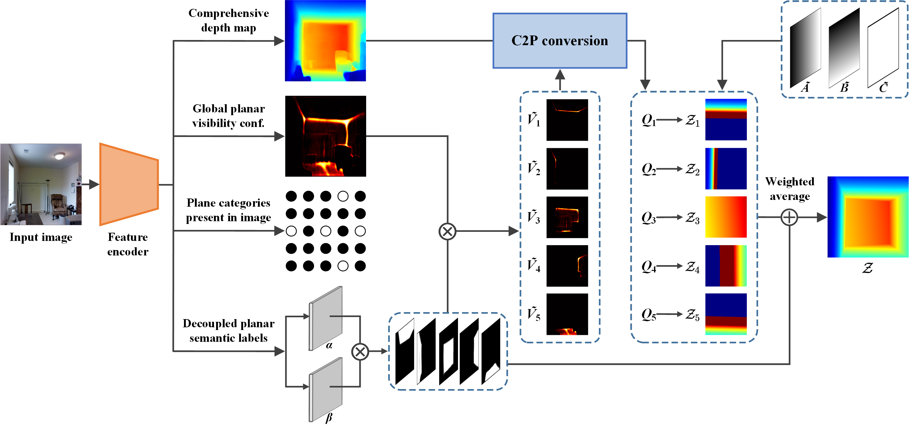
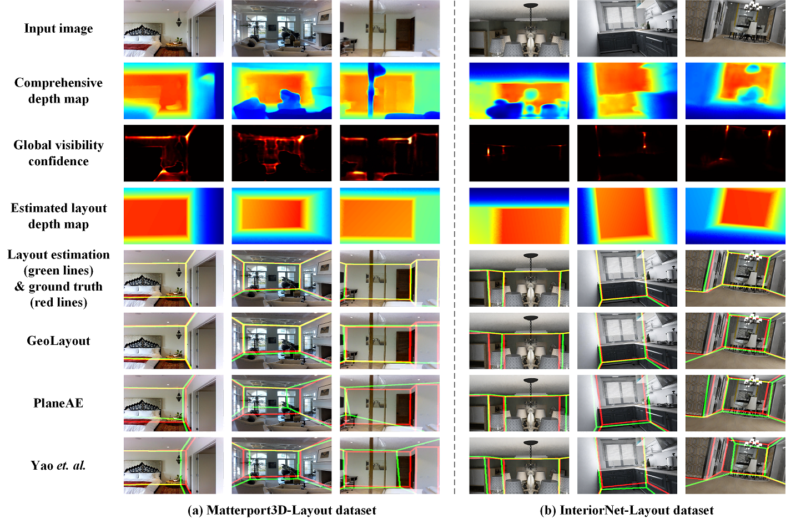
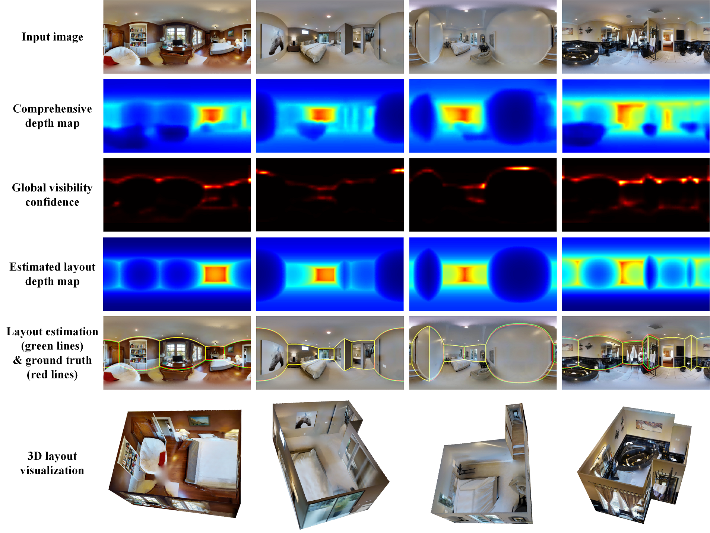

# C2P-Net-Comprehensive-Depth-Map-to-PlanarDepth-Conversion-for-Room-Layout-Estimation
We introduce the Comprehensive depth map to Planar depth (C2P) conversion, which reformulates planar depth reconstruction into the prediction of a comprehensive depth map and planar visibility confidence. Based on the parametric representation of planar depth we propose, the C2P conversion is applicable to both panoramic and perspective images.

An overview of C2P-Net for panoramic images.

An overview of C2P-Net for perspective images.

The visual results of perspective layout estimation on Matterport3D-Layout and InteriorNet-Layout datasets.

The visual results of panoramic layout estimation on MatterportLayout datase.
