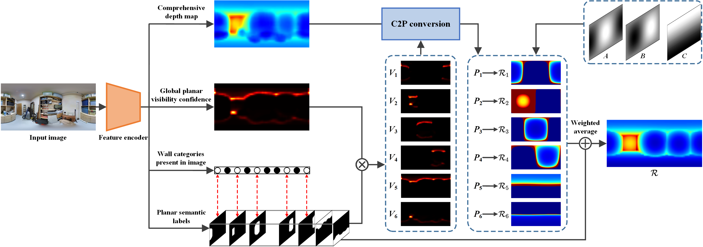
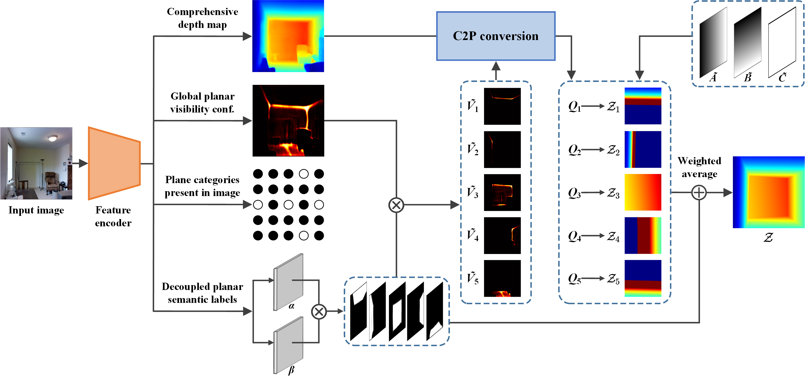

# C2P-Net-Comprehensive-Depth-Map-to-PlanarDepth-Conversion-for-Room-Layout-Estimation
In this paper, we introduce the Comprehensive depth map to Planar depth (C2P) conversion, which reformulates planar depth reconstruction into the prediction of a comprehensive depth map and planar visibility confidence. 

